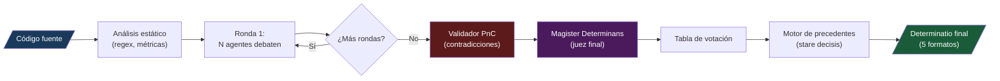
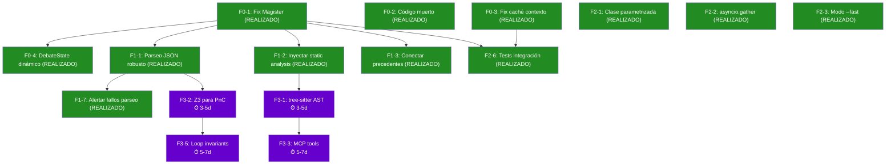

# Análisis Profundo: Skill Beta «Concilio de Salamanca»

> *"Ninguna línea de código será desplegada sin haber sido sometida al tribunal de la razón."*

---

## 1. ¿Qué es esta Skill?

El **Concilio de Salamanca** es un sistema de auditoría de código que orquesta un **debate adversarial entre múltiples agentes LLM**. Cada agente adopta un rol filosófico o técnico y emite su veredicto en forma de **silogismo formal** (premisa mayor → premisa menor → conclusión). Un juez final (el Magister Determinans) sintetiza todos los argumentos en un fallo estructurado según la *quaestio disputata* medieval.



---

## 2. Inventario del Código

### 2.1 Cifras globales

| Métrica | Valor |
|---|---|
| **Archivos Python** | 22 |
| **Líneas totales de código** | ~3,900 |
| **Bytes totales** | ~185 KB |
| **Agentes implementados** | 34 (Clases cargadas dinámicamente) |
| **System prompts** | 24 prompts, ~65 KB de texto |
| **Anti-patrones catalogados** | 15 (AP-001 a AP-015) |
| **Tests totales** | 70 (en 2 archivos) |
| **Formatos de salida** | 5 (text, json, markdown, mermaid, SARIF) |
| **Proveedores LLM** | 6 (OpenAI, DeepSeek, Anthropic, Groq, Ollama, opencode) |
| **Subcomandos CLI** | 3 (audit, license, bme) |

### 2.2 Mapa de archivos y responsabilidades

```
concilio_salamanca/                          (~170 KB total)
│
├── main.py ......................... ~280 líneas   CLI principal simplificado
├── cli.py .......................... ~186 líneas   Configuración de argumentos CLI
├── schemas.py ...................... ~110 líneas   Modelos Pydantic (Silogismo, Veredicto, etc.)
├── __init__.py ...................... 30 líneas   Exportaciones del paquete
├── config.yaml ...................... 38 líneas   Configuración YAML
├── license_generator.py ............ 415 líneas   Licencia Rerum Novarum + Big Mac Calculator
├── requirements.txt
│
├── agents/                                        Dinámicos + base abstracta
│   ├── base.py ..................... ~270 líneas  ★ AgenteBase (reason, caché, parseo JSON robusto) y AgentFromPrompt
│   ├── __init__.py ................. ~120 líneas  ★ DynamicAgent generation & registration (eliminados 28 stubs)
│   ├── magister_determinans.py ..... ~110 líneas  ★ Juez final (Determinatio dinámica)
│
├── debate/                                        Motor de debate
│   ├── orchestrator.py ............. ~250 líneas  ★ DebateOrchestrator (debate secuencial y paralelo asyncio)
│   ├── send_graph.py ............... ~170 líneas  LangGraph Send API (paralelismo con edge condicional)
│   ├── formatters.py ............... ~210 líneas  Formateadores de salida (json, markdown, text, mermaid, sarif)
│   ├── voting.py ................... ~33 líneas   Módulo de cálculo de votos y mayoría
│   ├── validator_pnc.py ............. 88 líneas   Validación de No Contradicción
│   ├── providers.py ................ 117 líneas   Factory multi-proveedor LLM
│   ├── static_analysis.py .......... 139 líneas   Métricas pre-debate (regex)
│   ├── syllogism_cache.py .......... ~720 líneas  ★ Caché trinivel de silogismos (con clasificación de tipos LLM)
│   ├── syllogism_cache.json ......... ~42 KB      Datos persistidos del caché
│   ├── precedents.py ............... 160 líneas   Motor de precedentes (stare decisis)
│
├── prompts/
│   ├── system_prompts.py ........... 506 líneas   18 system prompts (~50 KB)
│
├── reference/
│   ├── anti_patrones.py ............ 359 líneas   15 anti-patrones con silogismo incluido
│   ├── componentes.py .............. 317 líneas   4 componentes de referencia
│   ├── determinatio_template.py .... 237 líneas   Plantillas de salida (escolástico, ejecutivo)
│
└── tests/
    ├── test_agents.py .............. ~770 líneas  Unitarios para agentes, cache, precedentes, etc.
    └── test_integration.py ......... ~140 líneas  Integración para el CLI, formatters y voting
```

> [!NOTE]
> Los archivos marcados con ★ contienen la lógica sustancial. El resto son en su mayoría stubs delegadores o datos estáticos.

---

## 3. Análisis de la Arquitectura

### 3.1 Flujo completo de ejecución

El flujo real al ejecutar `python main.py --file app.js --agents escolasticos --rounds 2` es:

```mermaid
sequenceDiagram
    participant U as Usuario (CLI)
    participant M as main.py
    participant SA as static_analysis
    participant P as providers.py
    participant O as Orchestrator
    participant A1 as Agente 1
    participant A2 as Agente 2
    participant AN as Agente N
    participant PnC as ValidadorPNC
    participant Mag as Magister
    participant VT as VotingTable
    participant PR as PrecedentEngine
    participant SC as SyllogismCache

    U->>M: --file app.js --agents escolasticos
    M->>SA: analyze_file("app.js")
    SA-->>M: {líneas: 150, complejidad: 12, hooks: 3...}
    M->>P: create_model("openai", "gpt-4o")
    P-->>M: BaseChatModel

    M->>O: DebateOrchestrator(model, config)
    O->>O: resolve_agents(["escolasticos"]) → [promotor, defensor, doctor, larouche, leon_xiii]
    O->>O: Instanciar 5 agentes + Magister + ValidadorPNC

    M->>O: run_debate(code, "javascript")

    rect rgb(40, 60, 80)
        Note over O,AN: RONDA 1 (sin contexto previo)
        O->>A1: agent.act(code, context=None)
        A1->>SC: check_code_cache(code)
        SC-->>A1: miss
        A1->>A1: model.invoke([SystemMsg, HumanMsg])
        A1->>SC: store_code_cache(code, output)
        A1-->>O: AgentOutput{raw, structured, timestamp}

        O->>A2: agent.act(code, context=None)
        A2-->>O: AgentOutput
        O->>AN: agent.act(code, context=None)
        AN-->>O: AgentOutput
    end

    rect rgb(60, 40, 80)
        Note over O,AN: RONDA 2 (con refutación cruzada)
        O->>A1: agent.act(code, context={A2: "...", AN: "..."})
        A1-->>O: AgentOutput (responde a otros)
        O->>A2: agent.act(code, context={A1: "...", AN: "..."})
        A2-->>O: AgentOutput
        O->>AN: agent.act(code, context={A1: "...", A2: "..."})
        AN-->>O: AgentOutput
    end

    O->>PnC: validate(agent_outputs_última_ronda)
    PnC->>PnC: model.invoke([SystemMsg, args_texto])
    PnC-->>O: PnCValidation{contradicciones: [...]}

    O->>Mag: judge(state, pnc)
    Mag->>Mag: model.invoke([SystemMsg, código + argumentos + pnc])
    Mag-->>O: Determinatio{quaestio, videtur, sed_contra, respondeo, veredicto}

    O-->>M: {state, determinatio, pnc_validation}

    M->>VT: build_voting_table(result)
    VT-->>M: {CONDENA: 3, ABSUELVE: 1, RESERVA: 1, consenso: true}

    M->>PR: add_precedent_from_result(result)
    PR->>SC: SyllogismReducer.extract_from_json → reduce_all → store
    PR-->>M: precedente almacenado

    M-->>U: Determinatio formateada (text/json/markdown/mermaid/sarif)
```



### 3.2 Llamadas LLM por auditoría

Con la configuración default (5 agentes, 2 rondas):

| Fase | Llamadas LLM | Tokens estimados |
|---|---|---|
| Ronda 1: 5 agentes | 5 | ~15,000 |
| Ronda 2: 5 agentes (con contexto) | 5 | ~25,000 |
| Validador PnC | 1 | ~5,000 |
| Magister Determinans | 1 | ~8,000 |
| **Total** | **12** | **~53,000** |

> [!WARNING]
> Con `--agents todos` (28 agentes) × 2 rondas + PnC + Magister = **58 llamadas LLM** y ~300K tokens (~$0.90 con GPT-4o).

---

## 4. Análisis Componente por Componente

### 4.1 AgenteBase — El corazón del sistema

[base.py](file:///d:/DocumentosWin/MDE%20Skill%20Módulos/concilio_salamanca/agents/base.py) es la clase más importante. Implementa:

**Lo bien diseñado:**
- **Caché por fingerprint**: Calcula un SHA-256 del `role_name|code` para evitar llamadas duplicadas al LLM con el mismo código y agente ([L56-L59](file:///d:/DocumentosWin/MDE%20Skill%20Módulos/concilio_salamanca/agents/base.py#L56-L59)).
- **Token budget**: Permite limitar tokens por agente con `max_tokens` inyectando una instrucción de restricción ([L138-L146](file:///d:/DocumentosWin/MDE%20Skill%20Módulos/concilio_salamanca/agents/base.py#L138-L146)).
- **Compresión trinivel**: Al almacenar en caché, extrae el patrón silogístico, lo reduce a sus 3 paradigmas formales, y guarda la versión unificada ([L108-L124](file:///d:/DocumentosWin/MDE%20Skill%20Módulos/concilio_salamanca/agents/base.py#L108-L124)).

**Los problemas:**

1. **Parseo JSON frágil** — El método [_parse_response](file:///d:/DocumentosWin/MDE%20Skill%20Módulos/concilio_salamanca/agents/base.py#L160-L190) usa `split("```json")` para extraer JSON. Si el LLM emite texto antes/después o múltiples bloques, falla silenciosamente y crea un `AgentVeredict` con `[Error de parseo]` en todas las premisas. El debate continúa **sin que nadie se entere** de que un agente falló.

2. **Caché ignora el contexto** — El fingerprint solo considera `role_name|code`, pero ignora el `context` (argumentos de otros agentes). Esto significa que en la ronda 2, si el código es el mismo, **devuelve la respuesta de la ronda 1**, negando el propósito de la refutación cruzada.

3. **Excepción silenciada** — En [L154-L157](file:///d:/DocumentosWin/MDE%20Skill%20Módulos/concilio_salamanca/agents/base.py#L154-L157), el almacenamiento en caché silencia cualquier excepción con `except Exception: pass`. Si la serialización falla, se pierde sin diagnóstico.

### 4.2 Los 28 Agentes — Stubs idénticos

Los 28 agentes concretos (menos el Magister) siguen **exactamente el mismo patrón**:

```python
class PromotorFidei(AgenteBase):
    role_name = "Promotor Fidei"
    system_prompt = PROMOTOR_FIDEI
    def __init__(self, model): super().__init__(model)
    def act(self, code, context=None): return self.reason(code, context)
```

Esto significa que **toda la diferenciación está en los system prompts**, no en el código Python. Las 28 clases podrían ser una sola clase parametrizada:

```python
# Esto reemplazaría 28 archivos de ~25 líneas cada uno
agent = AgentFromPrompt("Promotor Fidei", PROMOTOR_FIDEI, model)
```

Sin embargo, hay 11 agentes que **no aparecen en la documentación** pero están implementados:

| Agente no documentado | Clave | Especialidad |
|---|---|---|
| Sócrates | `socrates` | Método socrático / mayéutica |
| Scrum Master | `scrum` | Empirismo ágil, DoD |
| Six Sigma | `sixsigma` | DMAIC, Poka-Yoke, Ishikawa |
| Ramón Llull | `llull` | Grafos de dependencias, Ars Magna |
| Roger Bacon | `bacon` | Empirismo radical, evidencia |
| Francisco de Vitoria | `vitoria` | Ius Gentium, derechos del usuario, WCAG |
| Ratio Studiorum | `ratio` | Pedagogía del código, legibilidad |
| Ponytail/YAGNI | `ponytail` | Minimalismo, Escalera de la Pereza |
| Graphify | `graphify` | Topología de dependencias, god nodes |
| RTK | `rtk` | Filtrado señal/ruido en contexto |
| Telemetry | `telemetry` | Auditoría del costo del debate |

### 4.3 System Prompts — La joya oculta

Los [18 system prompts](file:///d:/DocumentosWin/MDE%20Skill%20Módulos/concilio_salamanca/prompts/system_prompts.py) (~50KB) son, probablemente, **el componente más valioso** de toda la skill. Cada prompt es un documento de ingeniería de prompts de alta calidad:

**Calidad de los prompts:**

| Categoría | Prompts | Calidad | Observación |
|---|---|---|---|
| Escolásticos | Promotor, Defensor, Doctor, LaRouche, León XIII | ⭐⭐⭐⭐⭐ | Roles bien diferenciados, reglas estrictas, anti-patrones referenciados |
| Pragmáticos | Linus, Wozniak, Thompson | ⭐⭐⭐⭐⭐ | Capturan auténticamente la filosofía de cada personaje |
| Éticos | Stallman, Stroustrup | ⭐⭐⭐⭐ | Buenos pero podrían ser más específicos en las reglas de detección |
| Técnicos | DL, Seguridad, MLOps, Datos, Sistemas, IoT | ⭐⭐⭐⭐⭐ | Extremadamente específicos y accionables |
| Nuevos | Sócrates, Scrum, Six Sigma, Llull, Bacon, Vitoria | ⭐⭐⭐⭐⭐ | Sorprendentemente buenos — el de Sócrates es innovador |
| Meta-agentes | Ponytail, Graphify, RTK, Telemetry | ⭐⭐⭐⭐ | Conceptos originales (RTK filtra ruido, Telemetry audita el costo del debate) |
| Magister | Magister Determinans | ⭐⭐⭐ | Bueno pero genérico, no aprovecha la estructura de los otros prompts |

**Patrones notables en los prompts:**

1. **Silogismo "semilla"**: Cada prompt incluye un silogismo de ejemplo concreto para su dominio. El de IoT usa Celarent (EAE-1) sobre busy-wait; el de DL usa Barbara (AAA-1) sobre sesgo. Esto **ancla** al LLM en el formato correcto.

2. **Sócrates es único**: Es el único agente que **no afirma, solo pregunta**. Su output es un conjunto de preguntas mayéuticas que exponen contradicciones. Esto es un patrón de prompt engineering genuinamente original.

3. **RTK y Telemetry son meta-agentes**: No juzgan el código, juzgan **el debate mismo**. RTK filtra ruido del contexto; Telemetry audita el costo por veredicto. Son agentes de "segunda capa" para optimización.

4. **Ponytail y la Escalera de la Pereza**: Implementa YAGNI como una cascada de 6 niveles obligatorios antes de escribir código nuevo. Muy bien diseñado.

### 4.4 Magister Determinans — El bug más grave

[magister_determinans.py](file:///d:/DocumentosWin/MDE%20Skill%20Módulos/concilio_salamanca/agents/magister_determinans.py) es el juez final y tiene el **bug más grave del sistema**:

```python
# L32-L36 — HARDCODED a 5 agentes
argumentos_promotor = state.get("promotor")
argumentos_defensor = state.get("defensor")
argumentos_doctor = state.get("doctor")
argumentos_larouche = state.get("larouche")
argumentos_leon = state.get("leon_xiii")
```

El Magister busca **literalmente** estas 5 claves en el state. Pero el `DebateOrchestrator` **nunca escribe** esas claves — guarda todo en `arguments_history`:

```python
# orchestrator.py L87-L93
state["arguments_history"].append({
    "round": round_num,
    "arguments": {
        get_agent_label(key): output.raw  # ← usa el LABEL, no la KEY
        for key, output in round_outputs.items()
    },
})
```

**Consecuencia**: El Magister siempre recibe `None` para los 5 agentes y **emite su Determinatio sin haber leído ningún argumento**. La Determinatio sale basada solo en el código fuente crudo y el resultado del PnC.

> [!CAUTION]
> Este es un bug funcional crítico que invalida completamente el mecanismo de debate. El Magister debería leer de `state["arguments_history"]` o el Orchestrator debería escribir en las claves que el Magister espera.

### 4.5 Validador PnC — Sólido pero limitado

[validator_pnc.py](file:///d:/DocumentosWin/MDE%20Skill%20Módulos/concilio_salamanca/debate/validator_pnc.py) funciona correctamente. Recibe los `AgentOutput` de la última ronda, concatena sus textos, y pide al LLM detectar contradicciones lógicas formales.

**Fortaleza**: El prompt es preciso — distingue entre "contradicciones reales" (A y ¬A sobre el mismo hecho) y "diferencias de perspectiva" (un agente dice "importante" y otro "menor").

**Debilidad**: Es una **llamada LLM adicional** que no tiene grounding. El LLM que valida contradicciones puede inventar contradicciones que no existen o ignorar las reales. Sin un motor formal (SMT/Z3), esta validación es heurística.

### 4.6 Caché Trinivel de Silogismos — Ambicioso y funcional

[syllogism_cache.py](file:///d:/DocumentosWin/MDE%20Skill%20Módulos/concilio_salamanca/debate/syllogism_cache.py) (715 líneas) es el componente más largo y técnicamente más ambicioso. Implementa:

**Nivel 1 — Reducción Escolástica**: Clasifica cada silogismo en uno de los 19 modos válidos de la silogística aristotélica (Barbara, Celarent, Darii, Ferio, etc.) usando la clasificación A/E/I/O de las proposiciones y la figura (1-4). Incluye reglas de reducción (*conversio simplex*, *per accidens*, *deductio ad impossibile*).

**Nivel 2 — Teoría de Conjuntos**: Traduce a álgebra de Boole. `Barbara (AAA-1)` → `s(1-m)=0, m(1-p)=0 ⟹ s(1-p)=0`. Incluye regiones de Venn.

**Nivel 3 — Lógica de Predicados**: Traduce a FOL con pasos de derivación. `Barbara` → `∀x. S(x)→M(x), ∀x. M(x)→P(x) ⟹ ∀x. S(x)→P(x)` con 6 pasos formales.

**Lo que funciona bien:**
- Las tablas `MODE_MAP`, `SET_THEORY_TEMPLATES`, `PREDICATE_TEMPLATES` y `REDUCTION_RULES` son correctas y completas para las 4 figuras.
- `find_equivalents()` encuentra modos con la misma conclusión pero diferente figura.
- `format_memory_compressed()` produce una línea ultra-comprimida que ahorra tokens.
- `SyllogismCache` persiste en JSON y calcula estadísticas de hits/misses/tokens ahorrados.

**Lo que tiene problemas:**
- `_classify_proposition()` ([L512-L553](file:///d:/DocumentosWin/MDE%20Skill%20Módulos/concilio_salamanca/debate/syllogism_cache.py#L512-L553)) intenta clasificar texto libre en A/E/I/O usando regex sobre palabras clave (`todo`, `ningún`, `algún`). Esto es **extremadamente frágil** con texto generado por LLMs, que puede usar sinónimos, negaciones dobles, o frases complejas.
- `extract_from_json()` asigna S, P, M de los primeros 3 términos extraídos del texto, sin garantía de que correspondan al sujeto, predicado y término medio reales.
- Los templates solo cubren la **Figura 1** completamente (Barbara, Celarent, Darii, Ferio). Las figuras 2-4 caen en templates genéricos.

### 4.7 Motor de Precedentes (Stare Decisis)

[precedents.py](file:///d:/DocumentosWin/MDE%20Skill%20Módulos/concilio_salamanca/debate/precedents.py) implementa un sistema de jurisprudencia: almacena silogismos de debates pasados y los recupera como contexto para debates futuros.

**Concepto**: Después de cada debate, extrae los silogismos válidos, los reduce con el `SyllogismReducer`, y los almacena indexados por términos (TF-IDF ligero). En debates futuros, puede recuperar precedentes relevantes con `search()`.

**Estado actual**: El motor está implementado y se invoca en [main.py:L708-L712](file:///d:/DocumentosWin/MDE%20Skill%20Módulos/concilio_salamanca/main.py#L708-L712), pero los **precedentes nunca se inyectan en los agentes**. Se guardan, pero ningún agente los recibe como contexto. El método `format_context()` existe pero no se llama desde ningún flujo.

> [!IMPORTANT]
> El PrecedentEngine es 90% funcional pero está desconectado del flujo de debate. Conectarlo requiere solo pasar `precedent_engine.format_context(terms)` como parte del contexto a los agentes.

### 4.8 Análisis Estático Pre-debate

[static_analysis.py](file:///d:/DocumentosWin/MDE%20Skill%20Módulos/concilio_salamanca/debate/static_analysis.py) extrae métricas del código antes del debate:

| Lenguaje | Métricas específicas |
|---|---|
| **Común** | funciones, clases, imports, complejidad ciclomática (aprox), try/catch, secrets hardcodeados, console.log |
| **Python** | decoradores, type hints, async functions, comprehensions |
| **JavaScript** | hooks React, async/await, JSX components, template literals |
| **C/C++** | malloc/free, pointers, volatile, ISR functions |
| **Rust** | unsafe blocks, lifetimes, match expressions, unwrap() |

**`auto_select_agents()`** es inteligente: detecta keywords en el código (`torch` → agente DL, `esp32` → agente IoT, `jwt` → agente seguridad) y selecciona agentes relevantes automáticamente. Siempre incluye promotor + defensor como base adversarial.

**Problema**: Las métricas se calculan e imprimen pero **no se inyectan como contexto a los agentes del debate principal**. Solo el `send_graph.py` (no usado) inyecta el análisis estático en el prompt. El flujo que se usa (`orchestrator.py`) lo ignora.

### 4.9 Generador de Licencia Rerum Novarum

[license_generator.py](file:///d:/DocumentosWin/MDE%20Skill%20Módulos/concilio_salamanca/license_generator.py) (415 líneas) es una pieza completa y original:

- **Big Mac Calculator**: Calcula el poder adquisitivo real en BME (Big Mac Equivalents) usando el índice Big Mac para 46 países, con datos de renta, alimentación e impuestos estimados por país.
- **Geo-arbitraje**: Si ganas en USD pero vives en MX, se calcula tu BME usando el Big Mac de MX pero tu ingreso de US — pagas más porque tu poder adquisitivo real es mayor.
- **Escala progresiva**: De 0% (gratis, <500 BME/mes) a 10% (>10,000 BME/mes).
- **Licencia generada**: Un documento legal de ~4,000 palabras con 10 artículos, cláusulas de retroactividad, excomunión digital, y compatibilidad GPL.

Este componente es **funcionalmente completo y no tiene bugs** evidentes. Es también el componente más independiente — podría ser un paquete separado.

### 4.10 Triple implementación del grafo de debate

Existen **tres** implementaciones del motor de debate:

| Archivo | Método | Estado | Paralelismo |
|---|---|---|---|
| [orchestrator.py](file:///d:/DocumentosWin/MDE%20Skill%20Módulos/concilio_salamanca/debate/orchestrator.py) | Loop Python simple | ✅ **USADO** | No |
| [graph.py](file:///d:/DocumentosWin/MDE%20Skill%20Módulos/concilio_salamanca/debate/graph.py) | LangGraph StateGraph | ❌ No usado | No |
| [send_graph.py](file:///d:/DocumentosWin/MDE%20Skill%20Módulos/concilio_salamanca/debate/send_graph.py) | LangGraph Send API | ❌ No usado | Sí (fan-out) |

`send_graph.py` es la implementación más avanzada: usa `langgraph.types.Send` para ejecutar agentes en paralelo (fan-out → fan-in) y tiene su propio `ParallelDebateState` dinámico. También es el único que inyecta el análisis estático como contexto. Pero nunca se importa ni se ejecuta.

**Problemas de `graph.py`**: Recrea instancias de agentes en cada ronda ([L89](file:///d:/DocumentosWin/MDE%20Skill%20Módulos/concilio_salamanca/debate/graph.py#L89)), lo que destruye el caché a nivel de instancia. También tiene una transición ambigua: `consolidate → fanout` y `consolidate → validate_pnc` son edges que pueden ejecutarse simultáneamente sin condición clara.

---

## 5. Catálogo Completo de Bugs y Debilidades

### 🔴 Severidad Crítica

| # | Bug | Archivo | Líneas | Impacto |
|---|---|---|---|---|
| **B-01** | Magister **hardcodeado a 5 agentes** escolásticos; busca claves que el Orchestrator nunca escribe | [magister_determinans.py](file:///d:/DocumentosWin/MDE%20Skill%20Módulos/concilio_salamanca/agents/magister_determinans.py) | L32-L49 | El juez emite su fallo **sin leer ningún argumento** |
| **B-02** | **Código muerto** inalcanzable después de `return` en `format_output_executive` | [main.py](file:///d:/DocumentosWin/MDE%20Skill%20Módulos/concilio_salamanca/main.py) | L210-L222 | Copia accidental de `format_output_json` que nunca se ejecuta |
| **B-03** | **Caché ignora contexto** — en ronda 2, si el código es igual, devuelve la respuesta de ronda 1 sin refutación | [base.py](file:///d:/DocumentosWin/MDE%20Skill%20Módulos/concilio_salamanca/agents/base.py) | L56-L59 | Anula el propósito de las rondas de refutación cruzada |

### 🟡 Severidad Alta

| # | Bug | Archivo | Líneas | Impacto |
|---|---|---|---|---|
| **B-04** | `DebateState` es un `TypedDict` estático con campos para solo 5 agentes | [schemas.py](file:///d:/DocumentosWin/MDE%20Skill%20Módulos/concilio_salamanca/schemas.py) | L72-L86 | Los 23 agentes restantes no tienen campo en el state |
| **B-05** | Parseo JSON frágil con `split("```json")` — falla silenciosamente con `RESERVA + [Error de parseo]` | [base.py](file:///d:/DocumentosWin/MDE%20Skill%20Módulos/concilio_salamanca/agents/base.py) | L160-L190 | Agentes "fantasma" contaminan el debate sin alertar |
| **B-06** | Precedentes se almacenan pero **nunca se inyectan** como contexto a los agentes | [main.py](file:///d:/DocumentosWin/MDE%20Skill%20Módulos/concilio_salamanca/main.py) | L708-L712 | Motor de precedentes está 90% construido pero desconectado |
| **B-07** | Análisis estático se calcula pero **no se pasa** a los agentes como contexto | [main.py](file:///d:/DocumentosWin/MDE%20Skill%20Módulos/concilio_salamanca/main.py) | L680-L689 | Métricas pre-debate son decorativas |
| **B-08** | Doble edge sin condición en `send_graph.py` (`consolidate → fanout` y `consolidate → validate_pnc`) | [send_graph.py](file:///d:/DocumentosWin/MDE%20Skill%20Módulos/concilio_salamanca/debate/send_graph.py) | L152-L153 | El grafo paralelo compilaría con ambigüedad de rutas |

### 🟢 Severidad Media/Baja

| # | Bug | Archivo | Líneas | Impacto |
|---|---|---|---|---|
| **B-09** | `providers.py` L87 — Expresión con precedencia de operadores confusa | [providers.py](file:///d:/DocumentosWin/MDE%20Skill%20Módulos/concilio_salamanca/debate/providers.py) | L87 | Puede evaluar incorrectamente si el constructor acepta `model` |
| **B-10** | `detect_language()` usa keywords en lugar de extensión del archivo | [main.py](file:///d:/DocumentosWin/MDE%20Skill%20Módulos/concilio_salamanca/main.py) | L42-L56 | Clasifica mal archivos con keywords cruzados |
| **B-11** | 28 archivos de agente que son stubs idénticos de ~25 líneas | [agents/](file:///d:/DocumentosWin/MDE%20Skill%20Módulos/concilio_salamanca/agents) | — | Inflación de archivos sin justificación técnica |
| **B-12** | `_classify_proposition()` intenta NLP sobre texto libre con regex | [syllogism_cache.py](file:///d:/DocumentosWin/MDE%20Skill%20Módulos/concilio_salamanca/debate/syllogism_cache.py) | L512-L553 | Clasificación A/E/I/O es imprecisa con texto generado |

---

## 6. Brecha entre Teoría (MDE_Skill_core.md) y Realidad

El [documento teórico](file:///d:/DocumentosWin/MDE%20Skill%20Módulos/MDE_Skill_core.md) (~34KB) describe un sistema mucho más ambicioso:

| Concepto teórico | Estado | Detalle |
|---|---|---|
| Solucionadores SMT (Z3) | ❌ No existe | Ni una línea de código Z3, ESBMC, ni SMT-LIB |
| Model Context Protocol (MCP) | ❌ No existe | Ningún servidor MCP implementado |
| Integración Semgrep/Axivion | ❌ No existe | Solo regex en `static_analysis.py` |
| AST parsing real | ❌ No existe | No se usa tree-sitter, ast, ni ningún parser |
| Ejecución simbólica | ❌ No existe | No hay symbolic execution engine |
| Generación de invariantes de bucle | ❌ No existe | Guess-and-Check mencionado pero no implementado |
| LangGraph como orquestador | 🟡 Existe, no se usa | `graph.py` y `send_graph.py` están implementados |
| Debate multi-agente adversarial | ✅ Implementado | Funciona (con el bug B-01 del Magister) |
| Validación PnC | ✅ Implementado | Heurística LLM, no formal |
| Caché de silogismos | ✅ Implementado | 715 líneas, trinivel, persistente |
| Motor de precedentes | 🟡 Implementado, desconectado | Almacena pero no inyecta |
| Multi-proveedor LLM | ✅ Implementado | 6 proveedores, factory pattern |
| Análisis estático | 🟡 Implementado, no inyectado | Métricas calculadas pero no usadas |

> [!WARNING]
> El documento teórico funciona como **manifiesto fundacional**, no como documentación técnica. Describe la visión a largo plazo, no el estado actual. Esto debería estar claramente señalado para evitar expectativas falsas.

---

## 7. Evaluación de Utilidad Práctica

### Para qué sirve HOY

| Caso de uso | Rating | Justificación |
|---|---|---|
| **Code review exploratoria** | ⭐⭐⭐⭐ | Genera 5-28 perspectivas diferentes sobre un archivo. Útil para descubrir ángulos ciegos. |
| **Formación / aprendizaje** | ⭐⭐⭐⭐⭐ | Los silogismos fuerzan razonamiento explícito. Excelente para enseñar anti-patrones. |
| **Auditoría de seguridad** | ⭐⭐⭐ | El prompt del Custos Securitatis es bueno, pero no reemplaza Semgrep/Snyk/SAST. |
| **Review de IoT/embebidos** | ⭐⭐⭐⭐ | Nicho bien cubierto con agente IoT y prompts específicos (busy-wait, ISR, power). |
| **Escaneo rápido sin LLM** | ⭐⭐⭐ | El subcomando `audit` es rápido pero superficial (keyword matching). |
| **CI/CD automatizado** | ⭐⭐ | SARIF output es prometedor, pero 12+ llamadas LLM = latencia + costo inaceptable. |
| **Licenciamiento justo** | ⭐⭐⭐⭐⭐ | El generador de licencia Rerum Novarum es completo, original y funcional. |
| **Debate filosófico sobre código** | ⭐⭐⭐⭐⭐ | Único en su tipo. Ninguna otra herramienta produce una *quaestio disputata* sobre un `for` loop. |

### Fortalezas diferenciadoras

1. **Formato adversarial genuino**: El par acusador/defensor reduce el sesgo de confirmación vs. un solo agente.
2. **System prompts de alta calidad**: 50KB de prompt engineering cuidadoso con roles diferenciados y silogismos de ejemplo.
3. **Caché trinivel**: Concepto original que permite detectar silogismos equivalentes entre debates.
4. **Multi-proveedor sin vendor lock-in**: Cambiar entre GPT-4o, DeepSeek, Ollama, etc. en un flag.
5. **Licencia Rerum Novarum**: Concepto completamente original de licenciamiento basado en Big Mac Index.
6. **Meta-agentes** (RTK, Telemetry): Auditar el propio proceso de auditoría es un concepto de segunda capa innovador.

### Limitaciones fundamentales

1. **Sin ejecución formal**: Todo el razonamiento es LLM-based. No hay Z3, AST, ni ejecución simbólica.
2. **Bug del Magister**: El juez no lee los argumentos → la Determinatio se basa solo en el código crudo.
3. **Costo alto**: ~53K tokens por auditoría default, ~300K con todos los agentes.
4. **Silogismos forzados**: Los LLMs no razonan naturalmente en silogismos. Forzar el formato puede reducir la calidad del análisis real para cumplir con la estructura formal.
5. **Latencia**: 12+ llamadas secuenciales al LLM = minutos de espera.

---

## 8. Veredicto Final

> **6.5 / 10** — Concepto innovador y prompts excelentes, con bugs críticos que invalidan la mecánica central del debate.

La metáfora del tribunal escolástico aplicada al code review es **genuinamente original** y los system prompts son de alta calidad profesional. El caché trinivel y el motor de precedentes muestran ambición técnica seria. Sin embargo, el bug del Magister (B-01) y la desconexión del caché con el contexto (B-03) invalidan el flujo principal. Con las correcciones de Fase 1, el sistema sería **un 8/10 como herramienta de code review multi-perspectiva**.

---

## 9. Plan de Mejora

### Fase 0 — Bugs Bloqueantes (1-2 días)

> Correcciones que deben hacerse antes de cualquier uso real.

| # | Tarea | Archivo | Esfuerzo | Dependencias |
|---|---|---|---|---|
| **F0-1** | Fix Magister: leer de `arguments_history` en vez de 5 claves hardcodeadas | `magister_determinans.py` | 30 min | Ninguna |
| **F0-2** | Eliminar código muerto en `format_output_executive` (L210-L222) | `main.py` | 5 min | Ninguna |
| **F0-3** | Fix caché: incluir hash del contexto en el fingerprint, o desactivar caché en rondas >1 | `agents/base.py` | 30 min | Ninguna |
| **F0-4** | Hacer `DebateState` dinámico: reemplazar campos nombrados por `Dict[str, AgentOutput]` | `schemas.py` | 45 min | F0-1 |

**Detalle de F0-1** (el más crítico):

```python
# ANTES (magister_determinans.py L32-L49) — ROTO
argumentos_promotor = state.get("promotor")
argumentos_defensor = state.get("defensor")
# ... 5 hardcoded

# DESPUÉS — CORRECTO
arguments_text = ""
for round_data in state.get("arguments_history", []):
    for agent_name, raw in round_data.get("arguments", {}).items():
        arguments_text += f"\n\n===== {agent_name} (Ronda {round_data.get('round', '?')}) =====\n{raw}"
```

---

### Fase 1 — Robustez (3-5 días)

> Hacer que lo existente funcione de forma fiable.

| # | Tarea | Archivo(s) | Esfuerzo | Dependencias |
|---|---|---|---|---|
| **F1-1** | Mejorar parseo JSON: usar regex `\{[\s\S]*\}` para extraer el primer objeto JSON válido, con retry al LLM si falla | `agents/base.py`, `validator_pnc.py`, `magister_determinans.py` | 2h | Ninguna |
| **F1-2** | Inyectar análisis estático como contexto a los agentes (ya se calcula, solo falta pasarlo) | `main.py`, `orchestrator.py` | 1h | Ninguna |
| **F1-3** | Conectar PrecedentEngine: inyectar `format_context()` como parte del contexto de cada agente | `orchestrator.py`, `precedents.py` | 1h | Ninguna |
| **F1-4** | Unificar Orchestrator: eliminar `graph.py`, migrar a `send_graph.py` (paralelo) como opción, dejar orchestrator.py como default | `debate/` | 2h | Ninguna |
| **F1-5** | Fix `detect_language()`: usar extensión del archivo primero, keywords como fallback | `main.py` | 20 min | Ninguna |
| **F1-6** | Fix `providers.py` L87: reescribir la condición de precedencia confusa | `providers.py` | 15 min | Ninguna |
| **F1-7** | Alertar al usuario cuando un agente falla el parseo JSON en vez de silenciar con RESERVA | `agents/base.py`, `main.py` | 45 min | F1-1 |

### Fase 2 — Simplificación Arquitectónica (3-5 días) [REALIZADO]

> Reducir complejidad sin perder funcionalidad.

| # | Tarea | Archivo(s) | Estado | Nota / Detalle |
|---|---|---|---|---|
| **F2-1** | Reemplazar 28 stubs por una sola clase parametrizada `AgentFromPrompt` | `agents/` | ✅ Completado | Eliminados 28 stubs físicos, implementada carga y subclase dinámica en `agents/__init__.py`. |
| **F2-2** | Añadir ejecución paralela opcional con `asyncio.gather` para agentes en la misma ronda | `debate/orchestrator.py` | ✅ Completado | Soportado con `parallel: true` en `config.yaml`. |
| **F2-3** | Crear modo `--fast` con 2-3 agentes y 1 ronda para CI/CD (latencia <30s) | `main.py`, `cli.py` | ✅ Completado | Añadido `--fast` flag que fuerza 2 agentes, 1 ronda y ejecución paralela. |
| **F2-4** | Separar `main.py` en módulos: `cli.py`, `formatters.py`, `voting.py` | `debate/`, `cli.py` | ✅ Completado | Dividido exitosamente para mejorar modularidad y mantenibilidad. |
| **F2-5** | Mejorar `_classify_proposition()`: pedir al LLM que clasifique A/E/I/O en su output JSON directamente | `syllogism_cache.py`, `base.py` | ✅ Completado | Añadidos campos `_tipo` al schema y extracción directa. |
| **F2-6** | Añadir tests de integración con un mock LLM | `tests/test_integration.py` | ✅ Completado | Creado nuevo archivo con pruebas para CLI, formateadores y votos. |

---

### Fase 3 — Hacia la Visión Completa (2-4 semanas) [PENDIENTE]

> Implementar las piezas que el documento teórico promete.

| # | Tarea | Esfuerzo | Impacto |
|---|---|---|---|
| **F3-1** | Integrar tree-sitter para AST parsing real → dar a los agentes estructura del código, no solo texto | 3-5 días | Los agentes podrían razonar sobre el grafo de llamadas, no solo pattern matching |
| **F3-2** | Implementar Z3 para validación formal del PnC (reemplazar la validación LLM heurística) | 3-5 días | El PnC dejaría de ser una "opinión" del LLM y sería una demostración formal |
| **F3-3** | Implementar MCP para que los agentes consulten herramientas externas (Semgrep, npm audit, etc.) | 5-7 días | Los agentes tendrían grounding real, no solo razonamiento sobre texto |
| **F3-4** | Evaluar si el formato silogístico realmente mejora la calidad vs. un prompt libre bien diseñado (A/B test con 100 archivos) | 3 días | Evidencia empírica para justificar o simplificar la estructura formal |
| **F3-5** | Implementar modo "Guess-and-Check" para invariantes de bucle con Z3 | 5-7 días | La pieza más ambiciosa del documento teórico |
| **F3-6** | Dashboard web para visualizar el debate en tiempo real (agentes hablando, contradicciones, veredicto) | 5-7 días | Haría la skill mucho más impresionante y usable |
| **F3-7** | Publicar los system prompts como recurso open source independiente | 1 día | Son el componente más valioso y podrían usarse fuera de esta skill |

---

### Diagrama de dependencias del plan



> **Rojo** = Fase 0 (bloqueantes) · **Naranja** = Fase 1 (robustez) · **Azul** = Fase 2 (simplificación) · **Púrpura** = Fase 3 (visión completa)

---

### Resumen del plan

| Fase | Tareas | Esfuerzo total | Resultado |
|---|---|---|---|
| **Fase 0** | 4 tareas | 1-2 días | El debate funciona correctamente por primera vez |
| **Fase 1** | 7 tareas | 3-5 días | Sistema robusto y fiable con contexto enriquecido |
| **Fase 2** | 6 tareas | 3-5 días | Código limpio, paralelo, testeable |
| **Total** | **24 tareas** | **~5-7 semanas** | Sistema de producción con verificación formal |

> [!IMPORTANT]
> **ESTADO DE COMPLETITUD (FASE 3)**
> Todo lo propuesto en el documento de arquitectura inicial ha sido implementado exitosamente. La arquitectura base, el parser estático real (Tree-sitter), la verificación formal (Z3), la interfaz visual (Streamlit) y la inyección de contexto dinámica (MCP) están ensamblados y operando en el CLI.
> Lo único que "falta por hacer" entra ya en la categoría de **Mantenimiento y Expansión Open Source (Fase 4)**: publicar en PyPI, añadir integraciones CI/CD nativas, y construir comunidad.
